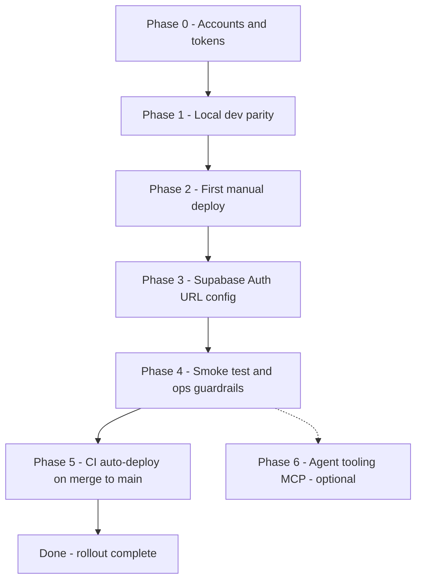

# Cloudflare integration & deployment rollout

Sequenced against the **Getting Started** section of [context/foundation/infrastructure.md](../foundation/infrastructure.md). Items 1 and 2 of that list are already done (stale-doc fix; `assets.run_worker_first` in [wrangler.jsonc](../../wrangler.jsonc)); this plan covers items 3 through 7 plus the external-integration glue and CI automation that the infra doc deliberately marked **Out of Scope**. **Phase 6 (MCP) is optional** — rollout is complete after Phase 5.

## Decisions locked in this round

- **Production Supabase already exists** — URL + anon key are ready to paste (no provisioning phase needed).
- **Docker not required for this rollout** — deploy target is Cloudflare Workers (no `Dockerfile`). Local dev and CI use **hosted** Supabase via `.dev.vars` / GitHub Secrets. Docker is only needed if you optionally run `npx supabase start` for an offline stack (see [Optional: local Supabase with Docker](#optional-local-supabase-with-docker) and [README — Docker setup](../../README.md#docker-setup-local-supabase-only)).
- **Hostname**: default `smart-tbr.<account>.workers.dev` — no custom domain in this rollout. Custom domain is parked as a "future phase" at the end.
- **CD shape**: first deploy is **manual** (catches account/token/Supabase-redirect issues with a human in the loop); after that, GitHub Actions **auto-deploys on push to `main`**. No per-PR preview deploys yet (parked).

## Phase dependency map



---

## Phase 0 — Prerequisites & accounts

Set up the accounts and credentials you'll need before touching the codebase. Nothing in this phase is destructive.

- [x] Cloudflare account exists; the e-mail can reach you (needed for the SSO challenge `wrangler login` triggers).
- [x] Run `npx wrangler login` once locally; verify with `npx wrangler whoami` — confirm the account ID it prints matches the account you want to deploy into.
- [x] In the Cloudflare dashboard, create an API token from the **"Edit Cloudflare Workers"** template (My Profile → API Tokens → Create Token). Save it somewhere short-term — you'll paste it into GitHub Secrets in Phase 5.
- [x] Capture the **Account ID** from the dashboard URL or `wrangler whoami` output. (Not actually secret, but you'll store it as a GitHub secret in Phase 5 for tidiness.)
- [x] You already have hosted Supabase URL + anon key in hand.
- [x] Confirm `.dev.vars` and `.env` are still gitignored (they are — [.gitignore](../../.gitignore) lines 17–23). Sanity-check with `git check-ignore -v .dev.vars`.
- [x] **Docker** — not needed for deploy or hosted-Supabase dev; install only if you plan the optional local stack in Phase 1 ([README](../../README.md#docker-setup-local-supabase-only)).

### Edge cases / extra support

- *Wrong account on `wrangler login`.* If you have multiple Cloudflare logins, `wrangler` picks the most-recent. Run `npx wrangler logout` then `wrangler login` again, and pick the right account in the OAuth popup.
- *Token template scopes.* The "Edit Cloudflare Workers" template grants `Account > Workers Scripts: Edit` + `Account > Account Settings: Read` + `User > User Details: Read` — these are exactly what `wrangler-action@v3` needs. **Do not** use the "Read All Resources" template; it has no write scope and fails with the unhelpful `code: 10000` auth error in CI. (Verified against [cloudflare/wrangler-action README](https://github.com/cloudflare/wrangler-action) and current community reports.)
- *Token expiry.* Default templates are non-expiring; if you opt into an expiry, calendar a reminder before the date or CI silently breaks.

---

## Phase 1 — Local dev parity (matches infra doc step 3)

Confirm the existing workerd-based dev loop works. `.dev.vars` and `.env` now use **hosted** Supabase (synced 2026-06-11 when Worker secrets were set).

- [x] Restored [.env.example](../../.env.example) and synced `.dev.vars` / `.env` with hosted Supabase credentials.
- [x] `npm install` — deps up to date.
- [x] `npm run dev` — boots on `http://localhost:4321/` via `@astrojs/cloudflare` workerd.
- [x] Sign-up round-trip against local Supabase — `POST /api/auth/signup` returns 302 → `/auth/confirm-email` with session cookies set.
- [x] `POST /api/auth/signin` via curl returns **302** (not Cloudflare 1003) when `Origin: http://localhost:4321` is set — validates `assets.run_worker_first: ["/api/*"]`. Bare curl without `Origin` gets Astro CSRF 403 (expected; not asset-shadowing).
- [x] `npm run build` — clean build with Supabase env set.

### Edge cases / extra support

- *workerd vs. node mismatch.* If something works under `npm run dev` but you have doubts, also run `npx wrangler dev` against the built `dist/` to see the exact production-style runtime. The infra doc's Risk Register (line 90) flags `wrangler dev` vs production parity gaps — not relevant for MVP scope but good muscle memory.
- *Email confirmation loop.* Per [README](../../README.md) lines 109–111, Supabase often enforces email confirmation. If sign-up succeeds but sign-in says "email not confirmed", either click through the email or temporarily disable **Authentication → Email → Confirm email** in the Supabase dashboard.
- *Stale Astro env types.* If you edit [astro.config.mjs](../../astro.config.mjs) env schema and the IDE complains, `npx astro sync` regenerates types (CI already does this — [.github/workflows/ci.yml](../../.github/workflows/ci.yml) line 19).

### Optional: local Supabase with Docker

Skip this block if you stay on hosted Supabase (recommended for this rollout). Use it only for offline iteration or schema work without touching the cloud project.

- [x] Install a Docker-API-compatible runtime — Docker Desktop / OrbStack in use.
- [x] Verify the daemon: `docker info` / `npx supabase status` succeeds.
- [x] `.env` populated from local stack output.
- [x] `npx supabase start` — stack running (`http://127.0.0.1:54321`).
- [ ] On untrusted networks, use the localhost-only network from [README — Docker setup](../../README.md#docker-setup-local-supabase-only) before `supabase start`.
- [x] `npm run dev` and auth smoke tests against the local stack (see Phase 1 checkmarks).
- [ ] `npx supabase stop` when finished to free RAM.

---

## Phase 2 — First production deploy (manual; infra doc steps 4–5)

Production deploy uses `npm run build` + `npx wrangler deploy` only — **no Docker build or registry step**.

Manual deploy now so the human is in the loop when the workers.dev subdomain, the secret push, and the version flip all touch live infrastructure for the first time.

- [x] `npm run build` — `dist/` produced (2026-06-11).
- [x] `npx wrangler deploy` — Worker live at **`https://smart-tbr.nicole-rozanska93.workers.dev`**. KV namespace `SESSION` auto-provisioned on first deploy.
- [x] Captured deployed URL and version ID `dbce985e-56ef-47c9-9265-3410d02f8417`.
- [x] `npx wrangler secret put SUPABASE_URL` — hosted URL uploaded (2026-06-11).
- [x] `npx wrangler secret put SUPABASE_KEY` — hosted anon key uploaded (2026-06-11).
- [x] `npx wrangler deployments list` — secrets-bearing deployment `ba258bef-c19d-4219-a190-d87f38584505` (Source: Secret Change).

### Edge cases / extra support

- *"Worker not found" on first `secret put`.* If you accidentally try `wrangler secret put` *before* the first `wrangler deploy`, wrangler will interactively offer to create a draft worker (fine locally), but the same flow fails in non-interactive CI. The deploy-first-secrets-second order in this checklist avoids that entirely.
- *workers.dev subdomain disabled.* By default the workers.dev subdomain is enabled per-Worker. If your account has previously disabled it globally (Workers & Pages → Subdomain), enable it for this Worker via Settings → Triggers → Custom Domains or via `workers_dev: true` in [wrangler.jsonc](../../wrangler.jsonc). Not common, worth knowing if the printed URL doesn't resolve.
- *Account selection.* If `wrangler whoami` shows you're in multiple accounts, add `account_id` to [wrangler.jsonc](../../wrangler.jsonc) to lock the deploy target (one-line addition). **Done** — `account_id: 10e6c5de7ae20000c186703ad894eab2` added 2026-06-11.
- *Build failure on missing `dist/`.* The `assets.directory: ./dist` binding requires the build artifact to exist — never run `wrangler deploy` without `npm run build` first.

---

## Phase 3 — External integration: Supabase Auth URL config

The most common silently-broken thing after a Workers deploy is Supabase Auth redirecting users to `http://localhost:3000` because the production hostname isn't allow-listed. Do this **before** the smoke test in Phase 4 or you'll waste 20 minutes debugging.

- [x] In the Supabase dashboard for your **hosted** project: **Authentication → URL Configuration** — [direct link](https://supabase.com/dashboard/project/kahvpxeygnmqpysrskok/auth/url-configuration) (confirmed 2026-06-11).
- [x] Set **Site URL** to `https://smart-tbr.nicole-rozanska93.workers.dev`.
- [x] Under **Additional Redirect URLs**, add `https://smart-tbr.nicole-rozanska93.workers.dev/**` — keep `http://localhost:4321/**` for local dev.
- [x] Save. Wait ~30 s for propagation.
- [ ] If you use email confirmation in production: open **Authentication → Email Templates → Confirm signup** and confirm the `{{ .ConfirmationURL }}` placeholder still points to the correct domain (it auto-uses Site URL).

### Edge cases / extra support

- *Exact-match trap.* Supabase Auth redirect URLs are **exact-match** unless you use wildcards. `https://smart-tbr.xyz.workers.dev` (no path) will NOT match `https://smart-tbr.xyz.workers.dev/dashboard`. Always include the `/**` wildcard. (Verified via Supabase docs and [supabase/auth#123](https://github.com/supabase/auth/issues/123).)
- *Wrong scheme.* Supabase compares scheme + host + port + path; `http://` won't match `https://`. Workers always serves HTTPS on workers.dev — never add an `http://` entry for production.
- *Preview-branch URL drift.* If you're on Supabase Branching, preview branches can silently reset URL config to defaults ([supabase/supabase#42323](https://github.com/supabase/supabase/issues/42323)). MVP only uses one production project, so this doesn't bite you yet — but worth knowing if you later add a staging Supabase branch.

---

## Phase 4 — Smoke test & operational guardrails (infra doc steps 5–6)

Confirm the full flow works end-to-end and put the ops surface in place so you can debug and roll back without ceremony.

- [x] Visit `https://smart-tbr.nicole-rozanska93.workers.dev/` — home page returns **200** (2026-06-11).
- [ ] Sign up with a real email; receive (or skip, per Supabase config) confirmation; sign in; land on `/dashboard`. **API signup verified** (`POST /api/auth/signup` → 302 `/auth/confirm-email` against hosted Supabase). Browser round-trip is a manual check — do this once in production.
- [ ] In a second terminal: `npx wrangler tail --format pretty` — confirm you see structured request logs as you click around in the browser.
- [x] `curl -i -X POST https://smart-tbr.nicole-rozanska93.workers.dev/api/auth/signin` — returns **403** body `Cross-site POST form submissions are forbidden` with **`cf-ray`** header (Worker handler, not Cloudflare 1003 asset router).
- [ ] In the Cloudflare dashboard: **Workers & Pages → smart-tbr → Settings → Usage Notifications** — set an alert at **80,000 req/day** (80% of the 100k Workers Free quota), email yourself.
- [x] Rehearse a rollback once now while it's cheap: rolled back to `dbce985e-56ef-47c9-9265-3410d02f8417` (home **200**), then redeployed; active version is CI deploy `5c90ce8c-731f-4588-9f5a-fb0a81995d3f` (2026-06-11).
- [ ] Bookmark ops links: [Cloudflare Worker](https://dash.cloudflare.com/10e6c5de7ae20000c186703ad894eab2/workers/services/view/smart-tbr) · [Supabase Auth users](https://supabase.com/dashboard/project/kahvpxeygnmqpysrskok/auth/users).

### Edge cases / extra support

- *Rollback ≠ data revert.* The infra doc spells this out (line 76): `wrangler rollback` reverts only the Worker bundle, not Supabase schema. If you ever ship a deploy with a Supabase migration, plan the migration reversal separately in Supabase Studio.
- *`wrangler tail` shows nothing.* If `observability.enabled` is false the tail might be empty; in our [wrangler.jsonc](../../wrangler.jsonc) lines 13–15 it's `true`, so this should just work. If logs are still missing, confirm you're tailing the right environment (`--env`) and that the Worker actually received the request (check the Cloudflare dashboard request count for the same minute).
- *Free-tier CPU alert.* In addition to the request-count alert, eyeball **Workers & Pages → smart-tbr → Metrics → CPU Time** weekly during the MVP. Per [context/foundation/lessons.md](../foundation/lessons.md) line 12, the 30 s CPU ceiling per request is your real cliff — not the request count.
- *Surprise paid bill.* Per infra Risk Register row 6, keep a card off-file until you're ready to commit; the worst case on the free tier is request throttling, not a charge.

---

## Phase 5 — CI auto-deploy on merge to `main`

Extend [.github/workflows/ci.yml](../../.github/workflows/ci.yml) (or split into `ci.yml` + `deploy.yml`) so that every push to `main` that passes lint + build also deploys.

- [x] In GitHub repo settings → Secrets and variables → Actions, add:
  - [x] `CLOUDFLARE_API_TOKEN` — set via `gh secret set` 2026-06-11.
  - [x] `CLOUDFLARE_ACCOUNT_ID` — `10e6c5de7ae20000c186703ad894eab2` (set via `gh secret set` 2026-06-11).
  - [x] `SUPABASE_URL` / `SUPABASE_KEY` — hosted values set via `gh secret set` 2026-06-11.
- [x] Added a `deploy` job to [.github/workflows/ci.yml](../../.github/workflows/ci.yml) that `needs: ci` and only runs on `push` to `main`. Single workflow file.
- [x] Uses `cloudflare/wrangler-action@v3` with `apiToken`, `accountId`, `command: deploy`, and `secrets:` bulk upload for `SUPABASE_URL` / `SUPABASE_KEY`.
- [x] Post-deploy smoke checks: home page `curl -fsS` + API route `cf-ray` assertion (same host as above).
- [x] Added `workflow_dispatch:` trigger for on-demand redeploy from the Actions UI.
- [x] Merge a change to `main`; watch the workflow; confirm Cloudflare receives a new deployment. **Done** — [PR #1](https://github.com/passiflora-nr/smart-tbr/pull/1) merged 2026-06-11; CI deploy job passed; version `5c90ce8c-731f-4588-9f5a-fb0a81995d3f`.

### Edge cases / extra support

- *Auth error code 10000 in CI.* Almost always the wrong API token template (e.g. read-only). Re-mint with "Edit Cloudflare Workers" — see Phase 0.
- *`Missing account_id`.* Either set `accountId` in the action input, or add `account_id = "..."` to [wrangler.jsonc](../../wrangler.jsonc). Cleaner to keep it in the action so the file stays portable.
- *`wrangler secret put` rejected with "latest version not deployed".* This is the "gradual deployments" trap. The `secrets:` input on `wrangler-action@v3` handles it correctly by ordering bulk-upload before deploy. If you ever drop down to raw `wrangler secret put` in CI, use `wrangler versions secret put` instead. (Confirmed in [workers-sdk PR #11882](https://github.com/cloudflare/workers-sdk/pull/11882).)
- *Manual approval gate.* The infra doc (line 77) recommends a human gate on production. Cheapest version: turn the `deploy` job's environment into a GitHub Environment with required reviewers (Settings → Environments → `production` → Required reviewers). Then any push to `main` waits for your one-click approval. Adds ~10 s of friction for the safety net.
- *Concurrent deploys.* If two pushes land back-to-back, the second overwrites the first version. Add `concurrency: { group: deploy, cancel-in-progress: false }` to the deploy job so they queue cleanly.

---

## Phase 6 — Agent tooling (MCP) *(optional; infra doc step 7)*

**Optional.** Skip this phase unless you want the agent to read Cloudflare logs and triage deploys via MCP tools instead of `wrangler tail` and the dashboard. Not required for deploy, auth, or CI.

- [ ] *(skipped)* Create `.cursor/mcp.json` at repo root with Cloudflare Code Mode + Observability servers — deferred; user opted out of MCP for this rollout.
- [ ] Restart Cursor; verify the agent can list MCP tools from both servers.
- [ ] Quick test: ask the agent to read the last 5 minutes of Worker logs via the observability server.

**`.cursor/mcp.json` template** (only if you enable this later):

```json
{
  "mcpServers": {
    "cloudflare-api": {
      "url": "https://mcp.cloudflare.com/mcp"
    },
    "cloudflare-observability": {
      "url": "https://observability.mcp.cloudflare.com/mcp"
    }
  }
}
```

### Edge cases / extra support

- *OAuth loop.* If the OAuth flow keeps re-prompting, kill cached creds in `~/.cursor/` and retry. Known to be flaky on first-ever login to a new MCP server.
- *Token bleed.* MCP servers run in the agent context — they have whatever scopes the OAuth flow granted. Don't grant write scopes you don't want the agent to use unattended.
- *No deploy-on-behalf without approval.* The infra doc Operational Story (line 77) lists which actions are agent-safe vs. require human approval. Re-read it before you give the agent the green light to run `wrangler deploy` itself.

---

## Parked for later (intentionally not in this rollout)

- **Custom domain** — add via Cloudflare Workers → Settings → Triggers → Custom Domains; remember to update Supabase Site URL + redirect URLs in Phase 3 again.
- **Per-PR preview deploys** — `wrangler versions upload` from a GitHub Actions job triggered on `pull_request`. The infra doc's Operational Story (line 74) describes the shape; defer until there's a beta cohort.
- **Hyperdrive for raw Postgres access from edge** — the infra doc flags this in reserve; only relevant if/when you bypass Supabase REST. Not for MVP.
- **Cloudflare Access in front of preview URLs** — only matters once a beta cohort exists.

---

## Remaining manual ops (post-rollout)

Rollout is **complete** (Phases 0–5). These unchecked items are optional dashboard/hygiene tasks — not blockers for deploy or CI.

| Item | Phase | Owner | Notes |
| ---- | ----- | ----- | ----- |
| Browser sign-up → confirm → sign-in → `/dashboard` | 4 | You | One-time production smoke test in the browser |
| `npx wrangler tail --format pretty` while clicking around | 4 | You | Confirms observability wiring |
| Cloudflare usage alert at 80k req/day | 4 | You | [Worker settings](https://dash.cloudflare.com/10e6c5de7ae20000c186703ad894eab2/workers/services/view/smart-tbr) |
| Bookmark ops dashboard links | 4 | You | Links in Phase 4 checklist above |
| Confirm signup email template uses Site URL | 3 | You | Only if email confirmation stays enabled in production |
| Local Docker: localhost-only network / `supabase stop` | 1 | You | Optional; only when using local stack |
| MCP agent tooling | 6 | — | **Skipped** — user opted out |

---

## How to use this file

- This plan is **archived** — rollout finished 2026-06-11. Live app: `https://smart-tbr.nicole-rozanska93.workers.dev`.
- For ongoing ops, use [infrastructure.md](../foundation/infrastructure.md) and [lessons.md](../foundation/lessons.md).
- Tick remaining manual ops above when convenient; no code changes required.
