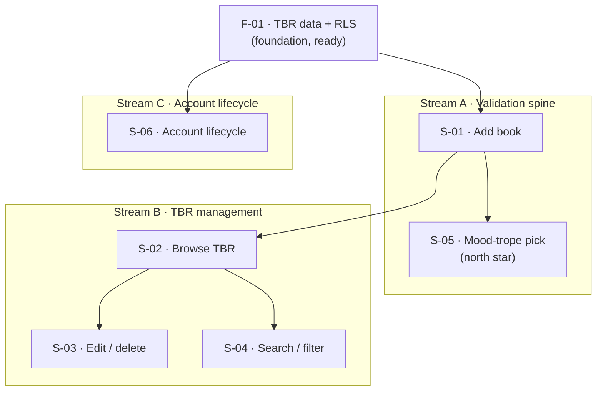

# Roadmap: SmartTBR

> Derived from `context/foundation/prd.md` (v1) + auto-researched codebase baseline.
> Edit-in-place; archive when superseded.
> Slices below are listed in dependency order. The "At a glance" table is the index.

## Vision recap

SmartTBR collapses a 100+ book "to be read" backlog that today lives scattered across Instagram saves, an Amazon wishlist, and phone notes into one private, trope-indexed pile. Unlike Goodreads/StoryGraph (which index by genre and rating), it treats "what trope am I in the mood for right now?" as the primary access pattern. The product wedge — the one trait that, if removed, makes it just another tracker — is mood-trope selection: the user picks 1-3 of their own free-text trope tags and gets up to 3 matching books from their own TBR, with no AI inference and no global vocabulary.

## North star

**S-05: User picks the next book by mood-tropes** — the smallest end-to-end flow whose success proves the core product hypothesis (that trope-overlap selection beats scrolling for escaping decision paralysis); placed as early as its prerequisites (a populated TBR) allow.

> "North star" here means the thinnest user-visible slice that, if it works, validates the whole bet — everything else only matters if this does.

## At a glance

| ID | Change ID | Outcome (user can ...) | Prerequisites | PRD refs | Status |
|---|---|---|---|---|---|
| F-01 | tbr-data-and-isolation | (foundation) books + trope tags persisted with per-user RLS isolation | - | FR-011, Access Control, NFR: isolation | ready |
| S-01 | add-book-to-tbr | add a book (title, author, tropes, optional description) to their private TBR | F-01 | FR-004, NFR: <=30s entry | proposed |
| S-05 | mood-trope-recommendation | pick 1-3 mood tropes and get up to 3 matching books from their own TBR | F-01, S-01 | US-01, FR-008, FR-009, FR-010, NFR: <=2s | proposed |
| S-02 | browse-tbr-list | browse their full TBR as a list | S-01 | FR-005 | proposed |
| S-03 | edit-delete-book | edit or delete any book in their TBR | S-02 | FR-006, FR-007 | proposed |
| S-04 | search-filter-tbr | narrow the TBR by title/author substring and/or trope filter | S-02 | FR-012 | proposed |
| S-06 | account-lifecycle | rely on gated routes and self-delete their account + all data | F-01 | FR-003, FR-013, FR-001, FR-002, Access Control | proposed |

## Streams

Navigation aid - groups items that share a Prerequisites chain. Canonical ordering still lives in the dependency graph below.

| Stream | Theme | Chain | Note |
|---|---|---|---|
| A | Validation spine | `F-01` -> `S-01` -> `S-05` | The north-star path; sequenced first per `main_goal: speed`. |
| B | TBR management | `S-02` -> `S-03` / `S-04` | Joins Stream A at `S-01`; `S-03` and `S-04` are parallel after `S-02`. |
| C | Account lifecycle | `S-06` | Depends on `F-01` + present auth; parallel with Stream B. |

## Dependency graph (illustration)

> Derived from **At a glance** (Prerequisites column) and each item's `- **Prerequisites:**` line. Illustration only — if this diagram diverges from the table or slice bodies, treat those as authoritative. Implementation specs live in `context/changes/<change-id>/plan.md`, not here.

## Baseline

What's already in place in the codebase as of 2026-06-14 (auto-researched + user-confirmed). Foundations below assume these are present and do NOT re-scaffold them.

- **Frontend:** present - Astro v6 + React 19 islands, Tailwind v4, shadcn (`new-york`); `src/layouts/Layout.astro`, `src/components/`, `src/pages/dashboard.astro`.
- **Backend / API:** partial - auth endpoints only (`src/pages/api/auth/{signin,signup,signout}.ts`); no book/TBR/recommendation routes.
- **Data:** absent - `supabase/config.toml` exists (local stack) but no migrations, no `books`/trope schema, no RLS policies.
- **Auth:** present - Supabase email+password wired (`src/lib/supabase.ts`, `src/middleware.ts` session check + `/dashboard` gate); FR-013 account deletion not built.
- **Deploy / infra:** present - Cloudflare Workers (`@astrojs/cloudflare`, `wrangler.jsonc`), GitHub Actions CI; first prod deploy/secrets may still be pending (`context/foundation/infrastructure.md`).
- **Observability:** absent - no Sentry/Datadog/OTel; `wrangler tail` + dashboard is the v1 story.

## Foundations

### F-01: TBR data layer with per-user isolation

- **Outcome:** (foundation) a `books` table carrying title, author, trope tags, optional description, and an owner reference, persisted in Supabase Postgres with Row-Level Security enforcing owner-only access.
- **Change ID:** tbr-data-and-isolation
- **PRD refs:** FR-011, Access Control, NFR (TBR never visible to another account)
- **Unlocks:** S-01, S-05, S-02, S-06; reduces the FR-011 cross-account-leak guardrail risk; establishes the verification path (RLS denies cross-account reads) every TBR slice relies on.
- **Prerequisites:** - (auth present in baseline)
- **Parallel with:** -
- **Blockers:** -
- **Unknowns:** Trope tags stored as a Postgres array on `books` vs a separate tags table - Owner: TBD (resolve in /10x-plan). Block: no.
- **Risk:** Sequenced first because isolation is a critical regression; the minimal contract is one table + RLS, not a full data layer - the first consuming slice (S-01) still exercises it end-to-end.
- **Status:** ready

## Slices

### S-01: Add a book to the TBR

- **Outcome:** user can add a book with title, author, one or more free-text trope tags, and an optional description, and see it saved to their private TBR.
- **Change ID:** add-book-to-tbr
- **PRD refs:** FR-004, NFR (<=30s manual entry)
- **Prerequisites:** F-01
- **Parallel with:** -
- **Blockers:** -
- **Unknowns:** -
- **Risk:** First write path against F-01; entry friction directly gates the Primary success criterion (migrate 100+ books), so the <=30s NFR is the load-bearing constraint here.
- **Status:** proposed

### S-05: Pick the next book by mood-tropes (north star)

- **Outcome:** user can open the trope-selection screen (populated from their own tropes), pick 1-3 mood tropes, and receive up to 3 matching books from their own TBR, each shown with title, author, and tropes - with empty states for no books / no tropes / no matches.
- **Change ID:** mood-trope-recommendation
- **PRD refs:** US-01, FR-008, FR-009, FR-010, NFR (<=2s end-to-end)
- **Prerequisites:** F-01, S-01
- **Parallel with:** S-02, S-06
- **Blockers:** -
- **Unknowns:** -
- **Risk:** The validation milestone; tag-set intersection over ~100 books is O(N) and fits the Workers per-request budget (per `lessons.md`). Sequenced as early as a populated TBR allows.
- **Status:** proposed

### S-02: Browse the TBR list

- **Outcome:** user can view their full TBR as a browsable list.
- **Change ID:** browse-tbr-list
- **PRD refs:** FR-005
- **Prerequisites:** S-01
- **Parallel with:** S-05, S-06
- **Blockers:** -
- **Unknowns:** -
- **Risk:** Narrow render contract (FR-012 search/filter is split into S-04); low risk.
- **Status:** proposed

### S-03: Edit and delete a book

- **Outcome:** user can edit any field of a book or delete it from their TBR.
- **Change ID:** edit-delete-book
- **PRD refs:** FR-006, FR-007
- **Prerequisites:** S-02
- **Parallel with:** S-04
- **Blockers:** -
- **Unknowns:** -
- **Risk:** Hard delete (no archived state per FR-007); edits to trope tags shift future recommendations, which is acceptable for v1.
- **Status:** proposed

### S-04: Search and filter the TBR

- **Outcome:** user can narrow the TBR list by substring match on title/author and/or by selecting one or more trope tags from a filter widget.
- **Change ID:** search-filter-tbr
- **PRD refs:** FR-012
- **Prerequisites:** S-02
- **Parallel with:** S-03
- **Blockers:** -
- **Unknowns:** -
- **Risk:** Makes a 100+ book list usable; required for the migration experience but not for the north-star ritual, so sequenced after the spine.
- **Status:** proposed

### S-06: Account lifecycle - gating and self-serve deletion

- **Outcome:** user's TBR routes are gated (unauthenticated visitors redirected to sign-in) and the user can permanently delete their own account, which cascades to all their books and trope tags and ends the session after an explicit confirmation.
- **Change ID:** account-lifecycle
- **PRD refs:** FR-013, FR-003, FR-001, FR-002, Access Control
- **Prerequisites:** F-01
- **Parallel with:** S-02, S-05
- **Blockers:** -
- **Unknowns:** Whether cascade delete is enforced via Postgres FK `on delete cascade` vs the auth-user deletion hook - Owner: TBD (resolve in /10x-plan). Block: no.
- **Risk:** Sign-up/sign-in/sign-out are baseline-present; the real work is extending `PROTECTED_ROUTES` in `src/middleware.ts` to cover new TBR routes and adding cascading account deletion (FR-013). RLS (F-01) is the actual isolation guarantee; route gating is the UX redirect.
- **Status:** proposed

## Backlog Handoff

| Roadmap ID | Change ID | Suggested issue title | Ready for /10x-plan | Notes |
|---|---|---|---|---|
| F-01 | tbr-data-and-isolation | TBR data layer with per-user RLS isolation | yes | Run `/10x-plan tbr-data-and-isolation` |
| S-01 | add-book-to-tbr | Add a book to the TBR | no | Needs F-01 done |
| S-05 | mood-trope-recommendation | Pick next book by mood-tropes (north star) | no | Needs F-01 + S-01 |
| S-02 | browse-tbr-list | Browse the TBR list | no | Needs S-01 |
| S-03 | edit-delete-book | Edit and delete a book | no | Needs S-02 |
| S-04 | search-filter-tbr | Search and filter the TBR | no | Needs S-02 |
| S-06 | account-lifecycle | Account gating + self-serve deletion | no | Needs F-01 |

## Open Roadmap Questions

(None roadmap-wide - all PRD Open Questions were resolved before this roadmap. Per-slice unknowns live in their slices and none block planning.)

## Parked

- **AI-generated details / trope inference / AI recommendation** - Why parked: PRD Non-Goals; explicit user-controlled trope-overlap IS the insight.
- **External imports (Goodreads/Amazon/CSV) and platform integrations** - Why parked: PRD Non-Goals; manual entry IS the migration.
- **Sharing / social graph / public profiles** - Why parked: PRD Non-Goals; enforces FR-011 isolation.
- **Native mobile app and any mobile-browser usability commitment** - Why parked: PRD Non-Goals; v1 is desktop-only.
- **Ranking within results, read/archived state, offline-first, data export** - Why parked: PRD Non-Goals; v2+ concerns.
- **Trope autocomplete (per-user)** - Why parked: PRD Non-Goal in v1; v2+ candidate triggered by lived fragmentation pain.
- **Global curated trope vocabulary / canonical normalization** - Why parked: permanent PRD Non-Goal; user wording IS the data.

## Done

(Empty on first generation. `/10x-archive` appends here when a matching change is archived.)
